# SellWise — Enterprise SaaS Implementation Plan

> **AI-Powered Sales Analytics & Inventory Management for Small Online Businesses**
> Designed as a scalable, production-grade SaaS product following enterprise software engineering principles.

---

## User Review Required

> [!IMPORTANT]
> **This plan has been fundamentally redesigned for enterprise SaaS.** Key changes from the previous version:
> 1. **TypeScript** replaces JavaScript across the entire stack — type safety is non-negotiable for a scalable product.
> 2. **Clean Architecture** with strict separation: Route → Controller → Service → Repository. Adding a new feature follows a predictable pattern every time.
> 3. **Redis + BullMQ** replaces `node-cache` and `node-cron` — jobs survive restarts, caching is distributed, and the system scales horizontally.
> 4. **Database migrations** replace raw `schema.sql` — versioned, reversible, CI/CD-safe.
> 5. **pnpm workspaces monorepo** with shared type definitions across frontend/backend.

> [!WARNING]
> **Trade-off acknowledgment:** This enterprise approach has a steeper initial setup cost (Week 1 will be heavier). But every week after that will be faster because the patterns, types, and infrastructure are already in place. New features become "copy the pattern, change the logic."

---

## 1. Engineering Principles

These principles govern every technical decision in this plan. Every team member must internalize them.

### 1.1 SOLID Principles Applied

| Principle | How We Apply It |
|-----------|----------------|
| **S**ingle Responsibility | Each file does ONE thing. `order.service.ts` contains order business logic. `order.repository.ts` handles order SQL. `order.controller.ts` handles HTTP request/response. Never mix them. |
| **O**pen/Closed | New features extend existing patterns without modifying core infrastructure. Adding "Expense Tracking" means adding new files following the existing Route→Controller→Service→Repository template. |
| **L**iskov Substitution | All repositories implement a base interface. `ProductRepository` and `OrderRepository` both follow `BaseRepository<T>` patterns — swappable and testable. |
| **I**nterface Segregation | Frontend API modules expose only what each page needs. `useProducts()` hook doesn't expose order-related functions. |
| **D**ependency Inversion | Services depend on repository *interfaces*, not concrete implementations. This allows easy mocking in tests and future database swaps. |

### 1.2 Additional Practices

| Practice | Implementation |
|----------|---------------|
| **DRY** | Shared Zod schemas (`packages/shared`) validate both frontend forms and backend requests — single source of truth |
| **Fail Fast** | Validation at API boundary (Zod middleware). Don't let bad data reach the service layer |
| **Convention over Configuration** | Strict file naming conventions. If you see `product.routes.ts`, you know `product.controller.ts`, `product.service.ts`, and `product.repository.ts` exist |
| **12-Factor App** | Config via environment variables, stateless processes, backing services as attached resources (PostgreSQL, Redis) |

---

## 2. System Architecture

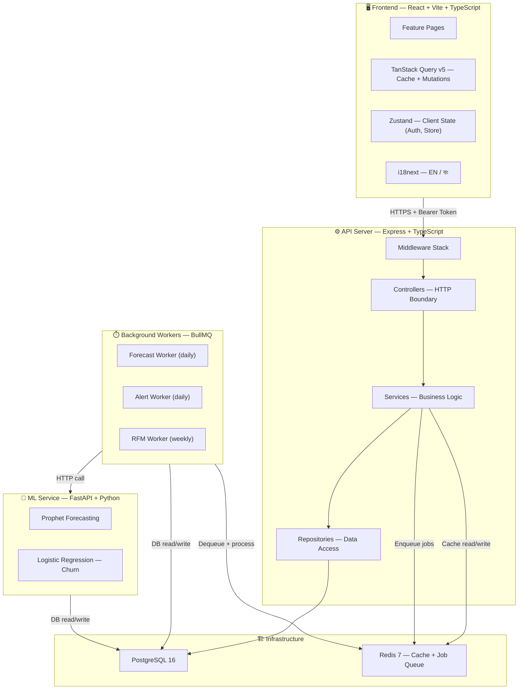

### Architecture Decisions & Rationale

| Decision | Previous Plan | Enterprise Plan | Why The Change |
|----------|--------------|-----------------|----------------|
| Language | JavaScript | **TypeScript** | Compile-time type safety prevents entire categories of bugs. IntelliSense makes the codebase self-documenting. Essential for team collaboration |
| Backend pattern | Flat routes + services | **Route → Controller → Service → Repository** (Clean Architecture) | Clear separation of concerns. Each layer is independently testable. New features follow a template |
| Caching | `node-cache` (in-process) | **Redis** | Survives server restarts. Works with multiple server instances (horizontal scaling). Shared between API and workers |
| Job scheduling | `node-cron` (in-process) | **BullMQ + Redis** | Jobs are durable (survive crashes), retryable, observable via dashboard, and horizontally scalable. `node-cron` loses all scheduled work on restart |
| DB management | Raw `schema.sql` | **node-pg-migrate** (versioned migrations) | Trackable in git, reversible, CI/CD-safe. Team members can pull and migrate without manual SQL |
| Validation | Joi (backend only) | **Zod (shared)** | Zod has first-class TypeScript support. Shared schemas in `packages/shared` mean frontend and backend validate identically |
| State management | React Context | **Zustand** | Simpler API, no provider nesting hell, built-in devtools, better performance (selective re-renders) |
| Monorepo | Flat directories | **pnpm workspaces** | Proper dependency isolation, shared packages, consistent tooling across all services |
| API responses | Ad-hoc JSON | **Standardized envelope** | Every endpoint returns `{ success, data, error, meta }` — predictable for frontend consumption |

---

## 3. Layered Architecture — How Code Flows

This is the single most important section for developer productivity. Every feature follows this exact pattern.

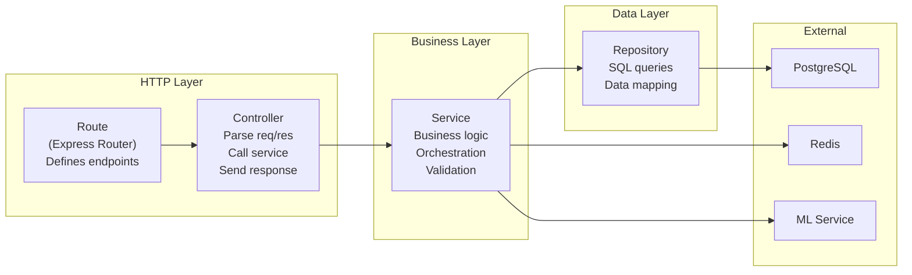

### What Each Layer Does (And Does NOT Do)

| Layer | Responsibility | Does NOT |
|-------|---------------|----------|
| **Route** | Define HTTP method + path. Attach middleware (auth, validation). Wire to controller | Contain any logic |
| **Controller** | Extract params/body/query from `req`. Call service method. Format `res.json()` response | Access database. Contain business rules |
| **Service** | Business logic: validation rules, calculations, orchestration between multiple repos. Transaction management | Write SQL. Know about HTTP (no `req`/`res`) |
| **Repository** | Raw SQL queries via `pg`. Data mapping (DB rows → TypeScript objects) | Contain business logic. Know about HTTP |

### Example: Adding a New Feature (Expense Tracking)

When you need to add a new feature, you create 4 files following the pattern:

```typescript
// 1. server/src/routes/expense.routes.ts
router.get('/', authenticate, requireRole(['owner']), expenseController.list);
router.post('/', authenticate, requireRole(['owner']), validate(createExpenseSchema), expenseController.create);

// 2. server/src/controllers/expense.controller.ts
export class ExpenseController {
  async list(req: Request, res: Response, next: NextFunction) {
    const { storeId } = req.params;
    const filters = req.query;
    const result = await expenseService.getExpenses(storeId, filters);
    res.json(ApiResponse.success(result));
  }
}

// 3. server/src/services/expense.service.ts
export class ExpenseService {
  async getExpenses(storeId: string, filters: ExpenseFilters): Promise<PaginatedResult<Expense>> {
    return this.expenseRepo.findByStore(storeId, filters);
  }
  async createExpense(storeId: string, data: CreateExpenseDTO): Promise<Expense> {
    // Business logic: validate category, check date range, etc.
    return this.expenseRepo.create({ ...data, store_id: storeId });
  }
}

// 4. server/src/repositories/expense.repository.ts
export class ExpenseRepository {
  async findByStore(storeId: string, filters: ExpenseFilters): Promise<PaginatedResult<Expense>> {
    const { rows } = await db.query('SELECT * FROM expenses WHERE store_id = $1 ...', [storeId]);
    return { data: rows, meta: { page, totalPages, totalCount } };
  }
}
```

> [!TIP]
> **This is why the architecture matters.** Adding expense tracking requires zero changes to existing code. You just create 4 new files following the exact same pattern as products, orders, and customers. Any team member can do it.

---

## 4. Standardized API Response Format

Every single endpoint in SellWise returns this format. No exceptions.

```typescript
// packages/shared/src/types/api.ts

interface ApiResponse<T> {
  success: boolean;
  data: T | null;
  error: {
    code: string;          // Machine-readable: 'VALIDATION_ERROR', 'NOT_FOUND', 'INSUFFICIENT_STOCK'
    message: string;       // Human-readable: 'Product not found'
    details?: unknown;     // Validation errors array, debug info, etc.
  } | null;
  meta?: {
    page?: number;
    limit?: number;
    totalCount?: number;
    totalPages?: number;
  };
}
```

**Success examples:**
```json
// GET /api/v1/stores/:storeId/products?page=1&limit=20
{
  "success": true,
  "data": [{ "id": "...", "name": "Wireless Mouse", ... }],
  "error": null,
  "meta": { "page": 1, "limit": 20, "totalCount": 142, "totalPages": 8 }
}

// POST /api/v1/stores/:storeId/orders
{
  "success": true,
  "data": { "id": "...", "order_number": "ORD-260715-0042", ... },
  "error": null
}
```

**Error examples:**
```json
// 409 Conflict — Insufficient stock
{
  "success": false,
  "data": null,
  "error": {
    "code": "INSUFFICIENT_STOCK",
    "message": "Insufficient stock for 'Wireless Mouse'. Available: 5, Requested: 10",
    "details": { "product_id": "...", "available": 5, "requested": 10 }
  }
}

// 422 Validation Error
{
  "success": false,
  "data": null,
  "error": {
    "code": "VALIDATION_ERROR",
    "message": "Request validation failed",
    "details": [
      { "field": "selling_price", "message": "Must be a positive number" },
      { "field": "name", "message": "Required" }
    ]
  }
}
```

---

## 5. Error Handling Hierarchy

```typescript
// server/src/errors/AppError.ts

export class AppError extends Error {
  constructor(
    public statusCode: number,
    public code: string,
    message: string,
    public details?: unknown
  ) {
    super(message);
  }
}

export class ValidationError extends AppError {
  constructor(details: ZodError) {
    super(422, 'VALIDATION_ERROR', 'Request validation failed', details.errors);
  }
}

export class NotFoundError extends AppError {
  constructor(resource: string) {
    super(404, 'NOT_FOUND', `${resource} not found`);
  }
}

export class ConflictError extends AppError {
  constructor(message: string, details?: unknown) {
    super(409, 'CONFLICT', message, details);
  }
}

export class ForbiddenError extends AppError {
  constructor(message = 'You do not have permission to perform this action') {
    super(403, 'FORBIDDEN', message);
  }
}

export class UnauthorizedError extends AppError {
  constructor(message = 'Authentication required') {
    super(401, 'UNAUTHORIZED', message);
  }
}
```

**Global error handler middleware** catches all errors and formats them consistently:
```typescript
// server/src/middleware/errorHandler.ts
export function errorHandler(err: Error, req: Request, res: Response, next: NextFunction) {
  if (err instanceof AppError) {
    return res.status(err.statusCode).json(ApiResponse.error(err.code, err.message, err.details));
  }
  // Unknown errors → 500 Internal Server Error (never leak stack traces in production)
  logger.error('Unhandled error', { error: err, requestId: req.id });
  return res.status(500).json(ApiResponse.error('INTERNAL_ERROR', 'An unexpected error occurred'));
}
```

---

## 6. Shared Validation Schemas (Zod)

Zod schemas live in `packages/shared` and are imported by both frontend and backend — **single source of truth**.

```typescript
// packages/shared/src/schemas/product.schema.ts
import { z } from 'zod';

export const createProductSchema = z.object({
  name: z.string().min(1, 'Product name is required').max(300),
  name_bn: z.string().max(300).optional(),
  sku: z.string().max(100).optional(),  // Auto-generated if blank
  category: z.string().max(100).optional(),
  cost_price: z.number().min(0, 'Cost price must be non-negative').default(0),
  selling_price: z.number().positive('Selling price must be positive'),
  stock_quantity: z.number().int().min(0, 'Stock cannot be negative').default(0),
  low_stock_threshold: z.number().int().min(0).default(10),
  unit: z.string().max(20).default('pcs'),
});

export type CreateProductDTO = z.infer<typeof createProductSchema>;

// --- Used in Backend ---
// router.post('/', validate(createProductSchema), controller.create);

// --- Used in Frontend ---
// const form = useForm<CreateProductDTO>({ resolver: zodResolver(createProductSchema) });
```

```typescript
// packages/shared/src/schemas/order.schema.ts
export const createOrderSchema = z.object({
  customer: z.object({
    name: z.string().min(1),
    phone: z.string().min(1),
    email: z.string().email().optional(),
    address: z.string().optional(),
  }),
  items: z.array(z.object({
    product_id: z.string().uuid(),
    quantity: z.number().int().positive(),
  })).min(1, 'Order must have at least one item'),
  delivery_charge: z.number().min(0).default(0),
  discount: z.number().min(0).default(0),
  notes: z.string().optional(),
  source: z.enum(['manual', 'csv_import', 'webhook', 'facebook', 'other']).default('manual'),
});

export type CreateOrderDTO = z.infer<typeof createOrderSchema>;
```

---

## 7. Tech Stack (Enterprise Grade)

### Frontend (`packages/client`)

| Package | Purpose | Why This Over Alternatives |
|---------|---------|---------------------------|
| React 19 + Vite 6 | UI framework + build tool | Industry standard, fast HMR |
| **TypeScript 5.5+** | Type safety | Non-negotiable for enterprise |
| `@tanstack/react-query` v5 | Server state management | Best-in-class caching, pagination, optimistic updates, devtools |
| `zustand` | Client state (auth, active store) | Simpler than Context, no provider nesting, great devtools |
| `react-router-dom` v7 | Routing | Industry standard, type-safe routes |
| `react-hook-form` + `@hookform/resolvers` | Forms | Performance (uncontrolled), integrates with Zod |
| `zod` | Validation | Shared with backend, TypeScript-native |
| `recharts` | Charts | React-native, composable, good TypeScript support |
| `axios` | HTTP client | Interceptors for JWT, error handling |
| `i18next` + `react-i18next` | Internationalization | Battle-tested, lazy loading, Bangla support |
| `lucide-react` | Icons | Tree-shakable, consistent style |
| `jspdf` + `jspdf-autotable` | PDF generation | Client-side, no server overhead |
| `papaparse` | CSV parsing | Client-side validation before upload |
| `date-fns` | Date utilities | Tree-shakable, immutable |
| `sonner` | Toast notifications | Beautiful, accessible, minimal API |
| `TailwindCSS v4` | Styling | Rapid development, consistent design system, excellent DX |

### Backend (`packages/server`)

| Package | Purpose | Why This Over Alternatives |
|---------|---------|---------------------------|
| Express 5 | Web framework | Mature, huge ecosystem, team familiarity |
| **TypeScript 5.5+** | Type safety | Matches frontend stack |
| `pg` (node-postgres) | PostgreSQL client | Low-level control, pool management, transactions |
| **`node-pg-migrate`** | Database migrations | Versioned, reversible, CI/CD-safe |
| `jsonwebtoken` | JWT auth | Industry standard |
| `bcryptjs` | Password hashing | Pure JS, no native compilation issues |
| **`zod`** | Request validation | Shared schemas with frontend |
| **`ioredis`** | Redis client | Connection pooling, cluster support, Lua scripting |
| **`bullmq`** | Job queue | Durable, retryable, observable jobs. Replaces `node-cron` |
| `winston` | Structured logging | JSON format, multiple transports, log levels |
| `helmet` | Security headers | One-line hardening |
| `cors` | CORS handling | Configurable origins |
| `express-rate-limit` + `rate-limit-redis` | Rate limiting | Redis-backed for distributed deployments |
| `multer` | File uploads | CSV file handling |
| `uuid` | UUID generation | For non-DB generated IDs |
| `dotenv` | Env vars | Config management |

### ML Service (`packages/ml-service`)

| Package | Purpose |
|---------|---------|
| FastAPI | HTTP API framework |
| uvicorn | ASGI server |
| prophet | Time-series demand forecasting |
| scikit-learn | Churn prediction (logistic regression) |
| pandas / numpy | Data manipulation |
| psycopg2-binary | PostgreSQL from Python |
| pydantic | Request/response validation |
| uv | Fast package management |

### Infrastructure

| Service | Purpose |
|---------|---------|
| PostgreSQL 16 | Primary database |
| Redis 7 | Cache + BullMQ job queue |
| Docker + Docker Compose | Local development orchestration |
| GitHub Actions | CI/CD pipeline |

---

## 8. Database — Migrations & Schema

### Migration Strategy

Instead of a raw `schema.sql`, we use **versioned migrations**:

```
packages/server/migrations/
├── 001_create-users-and-stores.ts
├── 002_create-products.ts
├── 003_create-customers.ts
├── 004_create-orders-and-items.ts
├── 005_create-expenses.ts
├── 006_create-forecasts.ts
├── 007_create-inventory-alerts.ts
├── 008_create-customer-rfm.ts
└── 009_seed-demo-data.ts
```

**Commands:**
```bash
pnpm --filter server migrate:up      # Run all pending migrations
pnpm --filter server migrate:down    # Rollback last migration
pnpm --filter server migrate:create  # Create a new migration file
```

**Why this matters:**
- Every team member runs `migrate:up` after pulling — no manual SQL execution
- Migrations are tracked in a `pgmigrations` table — the system knows what's been applied
- Each migration has an `up()` and `down()` function — fully reversible
- CI/CD pipeline runs migrations automatically before deployment

### Entity-Relationship Diagram

*(Schema definitions unchanged — the 11-table design from the previous plan is solid. See [SDP implementation_plan.md](file:///c:/Users/mrsoh/SDP/implementation_plan.md#L224-L427) for full SQL.)*

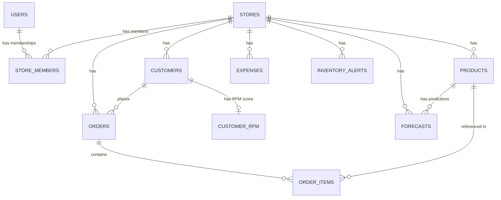

### Table Summary

| Table | Key Columns | Purpose |
|-------|-------------|---------|
| `users` | id (UUID), email, password_hash, preferred_lang | User accounts |
| `stores` | id, name, name_bn, currency, timezone | Business/store entities |
| `store_members` | store_id, user_id, role (`owner`/`manager`) | RBAC membership |
| `products` | store_id, name, sku, cost_price, selling_price, stock_quantity, is_active | Catalog with soft deletes |
| `customers` | store_id, name, phone, total_orders, total_spent | Auto-updated profiles |
| `orders` | store_id, customer_id, status, source, total, order_date | Order header |
| `order_items` | order_id, product_id, product_name, unit_price, cost_price, quantity | Snapshotted line items |
| `expenses` | store_id, category, amount, expense_date | Manual cost tracking |
| `forecasts` | store_id, product_id, forecast_date, predicted_qty, bounds | ML output |
| `inventory_alerts` | store_id, product_id, alert_type, severity, is_read | Auto-generated alerts |
| `customer_rfm` | customer_id, store_id, R/F/M scores, segment, churn_probability | Weekly ML output |

---

## 9. System Flows — Step-by-Step Workflows

All flows from the previous plan are retained with updated layer references.

---

### 9.1 Authentication & Store Setup Flow

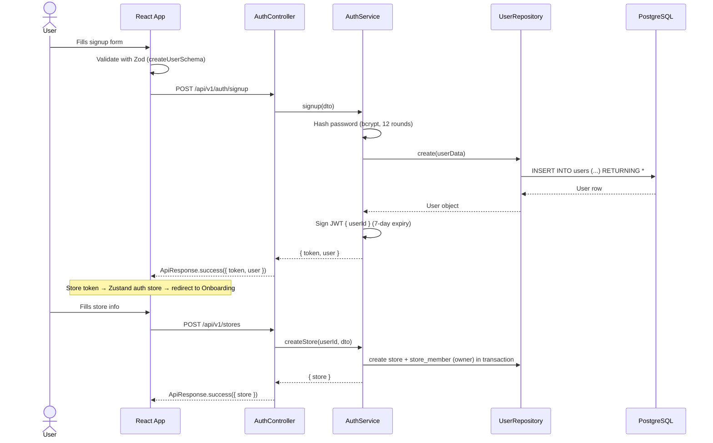

**Key details:**
- JWT payload: `{ userId, iat, exp }` — `storeId` is NOT in the token (user may own multiple stores)
- Active `storeId` comes from URL params, verified by RBAC middleware on each request
- Passwords: bcrypt with 12 salt rounds
- All API routes versioned: `/api/v1/...`

---

### 9.2 Request Lifecycle — Middleware Stack

Every request passes through this middleware chain:

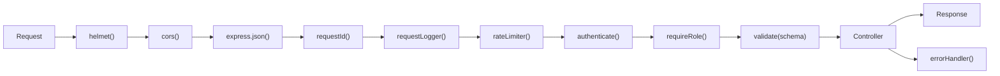

```typescript
// server/src/middleware/requestId.ts — Correlation ID for every request
export function requestId(req: Request, _res: Response, next: NextFunction) {
  req.id = req.headers['x-request-id'] as string || crypto.randomUUID();
  next();
}

// server/src/middleware/requestLogger.ts — Structured logging
export function requestLogger(req: Request, res: Response, next: NextFunction) {
  const start = Date.now();
  res.on('finish', () => {
    logger.info('request completed', {
      requestId: req.id,
      method: req.method,
      path: req.path,
      status: res.statusCode,
      durationMs: Date.now() - start,
      userId: req.user?.id,
      storeId: req.params.storeId,
    });
  });
  next();
}
```

---

### 9.3 Order Creation Flow (Critical Transaction)

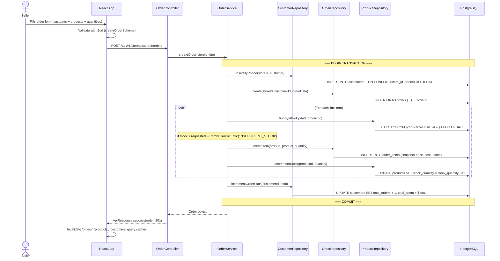

> [!WARNING]
> **`SELECT ... FOR UPDATE`** is critical for stock integrity. Without row-level locking, concurrent orders can oversell.

---

### 9.4 Order Status Lifecycle & Stock Restoration

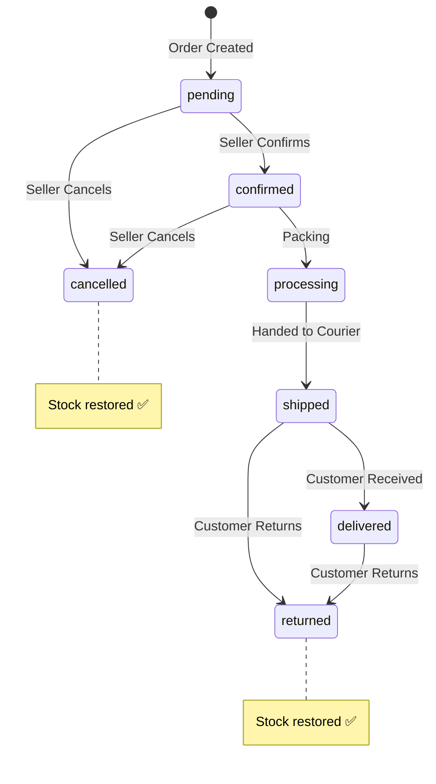

**Status transition rules** (enforced in `OrderService`):
- `cancelled` / `returned` → **stock restored** via transaction
- `cancelled` / `returned` → cannot transition to any other status (terminal states)
- Valid transitions are defined as a state machine map — invalid transitions throw `ConflictError`

---

### 9.5 Analytics Dashboard — Data Flow

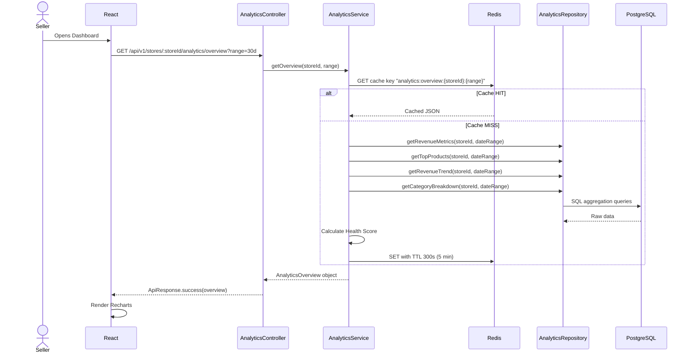

**Health Score formula** (in `AnalyticsService`):
```
Revenue Growth (40%): normalize(((current - previous) / previous) * 100)
Inventory Turnover (30%): normalize(COGS / avg_inventory_value)
Fulfillment Rate (30%): (delivered / total_non_cancelled) * 100

Health Score = growth_norm * 0.4 + turnover_norm * 0.3 + fulfillment_norm * 0.3
```

---

### 9.6 Background Job Pipeline (BullMQ)

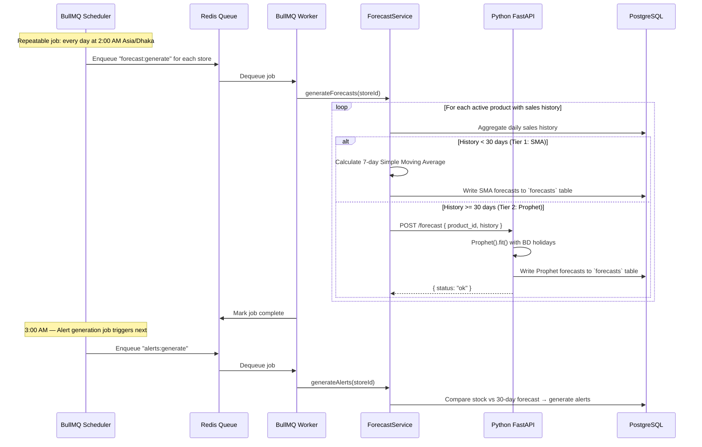

**BullMQ advantages over `node-cron`:**

| Feature | node-cron | BullMQ |
|---------|-----------|--------|
| Job survives server restart | ❌ No | ✅ Yes (persisted in Redis) |
| Retry on failure | ❌ Manual | ✅ Built-in (exponential backoff) |
| Concurrency control | ❌ None | ✅ Configurable workers |
| Job status dashboard | ❌ None | ✅ Bull Dashboard UI |
| Horizontal scaling | ❌ Runs on every instance | ✅ Job processed by exactly one worker |
| Job progress tracking | ❌ None | ✅ progress() callback |

---

### 9.7 Customer Intelligence (RFM + Churn)

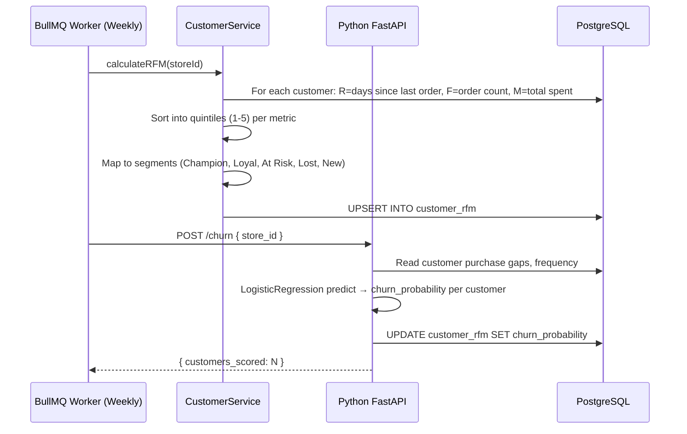

**RFM Segment Mapping:**

| R Score | F Score | M Score | Segment |
|---------|---------|---------|---------|
| 5 | 5 | 5 | 🏆 Champion |
| 4-5 | 4-5 | 4-5 | 💎 Loyal |
| 3-4 | 3-4 | 3-4 | 🌱 Potential |
| 2-3 | 1-3 | 1-3 | ⚠️ At Risk |
| 1 | 1-2 | 1-2 | 💤 Lost |
| 4-5 | 1 | 1 | 🆕 New Customer |

---

### 9.8 Webhook Order Ingestion (PoC)

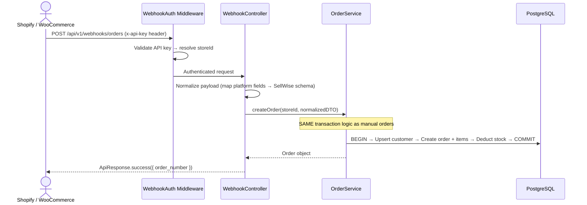

---

## 10. Project Structure (Enterprise)

```
sellwise/
├── packages/
│   ├── shared/                           # 📦 Shared TypeScript Package
│   │   ├── src/
│   │   │   ├── schemas/                  # Zod validation schemas
│   │   │   │   ├── auth.schema.ts
│   │   │   │   ├── product.schema.ts
│   │   │   │   ├── order.schema.ts
│   │   │   │   ├── customer.schema.ts
│   │   │   │   ├── expense.schema.ts
│   │   │   │   └── index.ts
│   │   │   ├── types/                    # TypeScript interfaces & types
│   │   │   │   ├── api.ts               # ApiResponse<T>, PaginatedResult<T>
│   │   │   │   ├── models.ts            # User, Store, Product, Order, etc.
│   │   │   │   ├── enums.ts             # OrderStatus, AlertType, ExpenseCategory, etc.
│   │   │   │   └── index.ts
│   │   │   ├── constants/                # Shared constants
│   │   │   │   ├── order-status.ts      # Status transition map
│   │   │   │   ├── rfm-segments.ts      # Segment definitions
│   │   │   │   └── index.ts
│   │   │   └── index.ts                  # Barrel export
│   │   ├── tsconfig.json
│   │   └── package.json
│   │
│   ├── client/                           # 🖥️ React Frontend
│   │   ├── public/
│   │   ├── src/
│   │   │   ├── main.tsx
│   │   │   ├── App.tsx
│   │   │   ├── api/                      # HTTP client layer
│   │   │   │   ├── client.ts            # Axios instance + interceptors
│   │   │   │   ├── auth.api.ts
│   │   │   │   ├── products.api.ts
│   │   │   │   ├── orders.api.ts
│   │   │   │   ├── analytics.api.ts
│   │   │   │   ├── customers.api.ts
│   │   │   │   ├── expenses.api.ts
│   │   │   │   ├── forecasts.api.ts
│   │   │   │   └── alerts.api.ts
│   │   │   ├── components/
│   │   │   │   ├── layout/              # Sidebar, Header, MainLayout
│   │   │   │   ├── ui/                  # Button, Modal, Input, Table, Badge, Card, DataTable
│   │   │   │   ├── charts/              # RevenueChart, CategoryPie, ForecastLine, HealthGauge
│   │   │   │   └── shared/              # LoadingState, EmptyState, ErrorBoundary, Pagination
│   │   │   ├── features/                # Feature-based page organization
│   │   │   │   ├── auth/
│   │   │   │   │   ├── LoginPage.tsx
│   │   │   │   │   ├── SignupPage.tsx
│   │   │   │   │   └── hooks/
│   │   │   │   │       └── useAuth.ts
│   │   │   │   ├── onboarding/
│   │   │   │   │   └── StoreSetupWizard.tsx
│   │   │   │   ├── dashboard/
│   │   │   │   │   ├── DashboardPage.tsx
│   │   │   │   │   └── hooks/
│   │   │   │   │       └── useDashboard.ts
│   │   │   │   ├── products/
│   │   │   │   │   ├── ProductListPage.tsx
│   │   │   │   │   ├── BulkImportPage.tsx
│   │   │   │   │   ├── components/
│   │   │   │   │   │   └── ProductForm.tsx
│   │   │   │   │   └── hooks/
│   │   │   │   │       └── useProducts.ts
│   │   │   │   ├── orders/
│   │   │   │   │   ├── OrderListPage.tsx
│   │   │   │   │   ├── CreateOrderPage.tsx
│   │   │   │   │   ├── OrderDetailPage.tsx
│   │   │   │   │   └── hooks/
│   │   │   │   │       └── useOrders.ts
│   │   │   │   ├── customers/
│   │   │   │   ├── expenses/
│   │   │   │   ├── forecasts/
│   │   │   │   ├── alerts/
│   │   │   │   ├── reports/
│   │   │   │   └── settings/
│   │   │   ├── stores/                   # Zustand stores
│   │   │   │   ├── auth.store.ts
│   │   │   │   └── store.store.ts       # Active store context
│   │   │   ├── lib/                      # Utility libraries
│   │   │   │   ├── query-client.ts      # TanStack Query client config
│   │   │   │   ├── i18n.ts             # i18next config
│   │   │   │   └── utils.ts            # formatCurrency, formatDate, cn()
│   │   │   ├── locales/
│   │   │   │   ├── en.json
│   │   │   │   └── bn.json
│   │   │   └── styles/
│   │   │       └── globals.css
│   │   ├── index.html
│   │   ├── vite.config.ts
│   │   ├── tailwind.config.ts
│   │   └── package.json
│   │
│   ├── server/                           # ⚙️ Node.js Backend
│   │   ├── src/
│   │   │   ├── index.ts                  # Server bootstrap
│   │   │   ├── app.ts                    # Express app setup (middleware + routes)
│   │   │   ├── config/
│   │   │   │   ├── env.ts               # Validated env vars (Zod)
│   │   │   │   ├── db.ts               # pg Pool setup
│   │   │   │   └── redis.ts            # ioredis connection
│   │   │   ├── errors/                   # Custom error classes
│   │   │   │   ├── AppError.ts
│   │   │   │   ├── ValidationError.ts
│   │   │   │   ├── NotFoundError.ts
│   │   │   │   ├── ConflictError.ts
│   │   │   │   └── index.ts
│   │   │   ├── middleware/
│   │   │   │   ├── authenticate.ts      # JWT verification
│   │   │   │   ├── requireRole.ts       # RBAC check
│   │   │   │   ├── validate.ts          # Zod schema validation
│   │   │   │   ├── requestId.ts         # Correlation ID
│   │   │   │   ├── requestLogger.ts     # Structured request logging
│   │   │   │   ├── rateLimiter.ts       # Redis-backed rate limiting
│   │   │   │   └── errorHandler.ts      # Global error handler
│   │   │   ├── routes/
│   │   │   │   ├── index.ts             # Route aggregator
│   │   │   │   ├── auth.routes.ts
│   │   │   │   ├── store.routes.ts
│   │   │   │   ├── product.routes.ts
│   │   │   │   ├── order.routes.ts
│   │   │   │   ├── customer.routes.ts
│   │   │   │   ├── expense.routes.ts
│   │   │   │   ├── analytics.routes.ts
│   │   │   │   ├── forecast.routes.ts
│   │   │   │   ├── alert.routes.ts
│   │   │   │   └── webhook.routes.ts
│   │   │   ├── controllers/
│   │   │   │   ├── auth.controller.ts
│   │   │   │   ├── store.controller.ts
│   │   │   │   ├── product.controller.ts
│   │   │   │   ├── order.controller.ts
│   │   │   │   ├── customer.controller.ts
│   │   │   │   ├── expense.controller.ts
│   │   │   │   ├── analytics.controller.ts
│   │   │   │   ├── forecast.controller.ts
│   │   │   │   ├── alert.controller.ts
│   │   │   │   └── webhook.controller.ts
│   │   │   ├── services/
│   │   │   │   ├── auth.service.ts
│   │   │   │   ├── store.service.ts
│   │   │   │   ├── product.service.ts
│   │   │   │   ├── order.service.ts      # Transaction logic
│   │   │   │   ├── customer.service.ts
│   │   │   │   ├── expense.service.ts
│   │   │   │   ├── analytics.service.ts  # SQL aggregation + Health Score
│   │   │   │   ├── forecast.service.ts   # SMA fallback + ML trigger
│   │   │   │   ├── alert.service.ts      # Alert generation logic
│   │   │   │   └── cache.service.ts      # Redis cache abstraction
│   │   │   ├── repositories/
│   │   │   │   ├── base.repository.ts    # Base CRUD operations
│   │   │   │   ├── user.repository.ts
│   │   │   │   ├── store.repository.ts
│   │   │   │   ├── product.repository.ts
│   │   │   │   ├── order.repository.ts
│   │   │   │   ├── customer.repository.ts
│   │   │   │   ├── expense.repository.ts
│   │   │   │   ├── analytics.repository.ts
│   │   │   │   ├── forecast.repository.ts
│   │   │   │   └── alert.repository.ts
│   │   │   ├── jobs/                     # BullMQ workers
│   │   │   │   ├── queues.ts            # Queue definitions
│   │   │   │   ├── scheduler.ts         # Repeatable job schedules
│   │   │   │   ├── forecast.worker.ts
│   │   │   │   ├── alert.worker.ts
│   │   │   │   └── rfm.worker.ts
│   │   │   └── utils/
│   │   │       ├── logger.ts            # Winston structured logger
│   │   │       ├── orderNumber.ts       # Sequential order number generator
│   │   │       └── ApiResponse.ts       # Standardized response builder
│   │   ├── migrations/                   # node-pg-migrate files
│   │   ├── seeds/                        # Demo data scripts
│   │   ├── tests/                        # Jest + supertest
│   │   │   ├── setup.ts
│   │   │   ├── auth.test.ts
│   │   │   ├── products.test.ts
│   │   │   └── orders.test.ts
│   │   ├── tsconfig.json
│   │   └── package.json
│   │
│   └── ml-service/                       # 🐍 Python ML Microservice
│       ├── app/
│       │   ├── main.py                   # FastAPI app
│       │   ├── routers/
│       │   │   ├── forecast.py           # POST /forecast
│       │   │   ├── churn.py              # POST /churn
│       │   │   └── health.py             # GET /health
│       │   ├── services/
│       │   │   ├── prophet_service.py    # Prophet + BD holidays
│       │   │   └── churn_service.py      # Logistic regression
│       │   ├── models/                   # Pydantic request/response models
│       │   │   └── schemas.py
│       │   └── utils/
│       │       ├── db.py                 # psycopg2 pool
│       │       └── logger.py
│       ├── tests/
│       │   └── test_forecast.py
│       ├── pyproject.toml
│       └── Dockerfile
│
├── docker-compose.yml                    # PostgreSQL + Redis + Adminer
├── docker-compose.prod.yml               # Production overrides
├── .github/
│   └── workflows/
│       ├── ci.yml                        # Lint + Type-check + Test on PR
│       └── deploy.yml                    # Deploy on merge to main
├── pnpm-workspace.yaml
├── turbo.json                            # Turborepo build orchestration (optional)
├── .gitignore
├── .env.example
└── README.md
```

---

## 11. Frontend Architecture — Feature-Based Organization

### Routing Structure

```
/login                          → LoginPage
/signup                         → SignupPage
/onboarding                     → StoreSetupWizard

/stores/:storeId/
  ├── dashboard                 → DashboardPage
  ├── products                  → ProductListPage
  │   └── /import               → BulkImportPage
  ├── orders                    → OrderListPage
  │   ├── /new                  → CreateOrderPage
  │   └── /:orderId             → OrderDetailPage
  ├── customers                 → CustomerListPage
  │   └── /:customerId          → CustomerDetailPage
  ├── expenses                  → ExpenseListPage
  ├── forecasts                 → ForecastOverviewPage
  │   └── /:productId           → ProductForecastDetailPage
  ├── alerts                    → AlertsPage
  ├── reports                   → ReportGeneratorPage
  └── settings                  → StoreSettingsPage
```

### Frontend Patterns

**Feature-based hooks** encapsulate all TanStack Query logic:
```typescript
// features/products/hooks/useProducts.ts
export function useProducts(storeId: string, filters: ProductFilters) {
  return useQuery({
    queryKey: ['products', storeId, filters],
    queryFn: () => productsApi.list(storeId, filters),
  });
}

export function useCreateProduct(storeId: string) {
  const queryClient = useQueryClient();
  return useMutation({
    mutationFn: (data: CreateProductDTO) => productsApi.create(storeId, data),
    onSuccess: () => queryClient.invalidateQueries({ queryKey: ['products', storeId] }),
  });
}
```

**Zustand stores** for client-only state:
```typescript
// stores/auth.store.ts
interface AuthState {
  token: string | null;
  user: User | null;
  setAuth: (token: string, user: User) => void;
  logout: () => void;
}
export const useAuthStore = create<AuthState>()(
  persist((set) => ({
    token: null,
    user: null,
    setAuth: (token, user) => set({ token, user }),
    logout: () => set({ token: null, user: null }),
  }), { name: 'sellwise-auth' })
);
```

---

## 12. API Endpoint Reference (Versioned)

All routes prefixed with `/api/v1/` for backward compatibility in future versions.

### Auth
| Method | Endpoint | Auth |
|--------|----------|------|
| POST | `/api/v1/auth/signup` | No |
| POST | `/api/v1/auth/login` | No |
| GET | `/api/v1/auth/me` | Yes |

### Stores
| Method | Endpoint | Auth |
|--------|----------|------|
| POST | `/api/v1/stores` | User |
| GET | `/api/v1/stores` | User |
| PUT | `/api/v1/stores/:storeId` | Owner |

### Products
| Method | Endpoint | Auth |
|--------|----------|------|
| GET | `/api/v1/stores/:storeId/products` | Owner/Manager |
| POST | `/api/v1/stores/:storeId/products` | Owner/Manager |
| POST | `/api/v1/stores/:storeId/products/bulk` | Owner/Manager |
| PUT | `/api/v1/stores/:storeId/products/:id` | Owner/Manager |
| DELETE | `/api/v1/stores/:storeId/products/:id` | Owner |
| PATCH | `/api/v1/stores/:storeId/products/:id/stock` | Owner/Manager |

### Orders
| Method | Endpoint | Auth |
|--------|----------|------|
| GET | `/api/v1/stores/:storeId/orders` | Owner/Manager |
| POST | `/api/v1/stores/:storeId/orders` | Owner/Manager |
| GET | `/api/v1/stores/:storeId/orders/:id` | Owner/Manager |
| PATCH | `/api/v1/stores/:storeId/orders/:id/status` | Owner/Manager |
| POST | `/api/v1/webhooks/orders` | API Key |

### Customers
| Method | Endpoint | Auth |
|--------|----------|------|
| GET | `/api/v1/stores/:storeId/customers` | Owner/Manager |
| GET | `/api/v1/stores/:storeId/customers/:id` | Owner/Manager |
| POST | `/api/v1/stores/:storeId/customers` | Owner/Manager |

### Expenses
| Method | Endpoint | Auth |
|--------|----------|------|
| GET | `/api/v1/stores/:storeId/expenses` | Owner |
| POST | `/api/v1/stores/:storeId/expenses` | Owner |
| DELETE | `/api/v1/stores/:storeId/expenses/:id` | Owner |

### Analytics
| Method | Endpoint | Auth |
|--------|----------|------|
| GET | `/api/v1/stores/:storeId/analytics/overview` | Owner/Manager |
| GET | `/api/v1/stores/:storeId/analytics/revenue` | Owner/Manager |

### Forecasts & Alerts
| Method | Endpoint | Auth |
|--------|----------|------|
| GET | `/api/v1/stores/:storeId/forecasts/:productId` | Owner/Manager |
| GET | `/api/v1/stores/:storeId/alerts` | Owner/Manager |
| PATCH | `/api/v1/stores/:storeId/alerts/:id/read` | Owner/Manager |
| PATCH | `/api/v1/stores/:storeId/alerts/read-all` | Owner/Manager |

---

## 13. CI/CD Pipeline

```yaml
# .github/workflows/ci.yml
name: CI
on: [pull_request]
jobs:
  quality:
    runs-on: ubuntu-latest
    steps:
      - uses: actions/checkout@v4
      - uses: pnpm/action-setup@v4
      - run: pnpm install --frozen-lockfile
      - run: pnpm --filter shared build          # Build shared types first
      - run: pnpm --filter server lint            # ESLint
      - run: pnpm --filter server typecheck       # tsc --noEmit
      - run: pnpm --filter client lint
      - run: pnpm --filter client typecheck
  
  test:
    runs-on: ubuntu-latest
    services:
      postgres:
        image: postgres:16
        env: { POSTGRES_DB: sellwise_test, POSTGRES_PASSWORD: test }
        ports: ['5432:5432']
      redis:
        image: redis:7
        ports: ['6379:6379']
    steps:
      - uses: actions/checkout@v4
      - uses: pnpm/action-setup@v4
      - run: pnpm install --frozen-lockfile
      - run: pnpm --filter shared build
      - run: pnpm --filter server test            # Jest + supertest
      - run: pnpm --filter ml-service test        # pytest
```

---

## 14. Development Roadmap — 10 Weeks (Enterprise)

> [!IMPORTANT]
> The enterprise architecture front-loads infrastructure work in Weeks 1-2. This pays massive dividends from Week 3 onward — every new feature becomes "follow the pattern."

### Week 1: Monorepo Setup, Infrastructure, Schema
| Who | Task |
|-----|------|
| M1 (Backend) | Init `packages/server` with TypeScript, Express, pg, ioredis, BullMQ. Create `config/`, `errors/`, `middleware/` (auth, RBAC, validation, errorHandler, requestId, requestLogger). Write `ApiResponse` helper class |
| M2 (Frontend) | Init `packages/client` with Vite + React + TypeScript + TailwindCSS v4. Set up TanStack Query, Zustand, react-router, axios client with JWT interceptor |
| M3 (ML) | Init `packages/ml-service` with FastAPI + pydantic. Set up `/health` endpoint, psycopg2 pool, logging |
| M4 (UI/UX) | Figma wireframes: Login, Dashboard, Products, Orders. Define design system: colors, typography, spacing scale |
| M5 (DevOps) | Init pnpm workspace + `packages/shared`. Create `docker-compose.yml` (Postgres 16 + Redis 7 + Adminer). Set up GitHub repo, branch protection, CI workflow. Write all database migrations (001-008) |
| ALL | Agree on coding conventions: file naming, import ordering, commit message format |

**Deliverable**: All services run locally with `docker-compose up` + `pnpm dev`. Shared types importable. DB migrations work. CI pipeline runs on PRs.

---

### Week 2: Auth + Store + Base Repository Pattern
| Who | Task |
|-----|------|
| M1 | Build `base.repository.ts` (generic CRUD). Build `user.repository.ts`, `store.repository.ts`. Build `auth.service.ts` (signup/login/JWT). Build `store.service.ts` (create/list) |
| M2 | Build auth pages (Login, Signup). Wire to API. Zustand auth store. Protected route wrapper |
| M4 | Style auth pages (premium glassmorphism). Build MainLayout (Sidebar + Header). Store Setup Wizard UI |
| M1+M5 | RBAC middleware. `store.routes.ts` + `store.controller.ts` |
| M5 | Seed migration with demo user + store for quick dev resets |

**Deliverable**: Full auth flow working. Store creation working. RBAC enforced. Every team member understands the Route→Controller→Service→Repository pattern.

---

### Week 3: Product Management
| Who | Task |
|-----|------|
| M1 | `product.repository.ts` (CRUD + paginated search + soft delete + bulk insert). `product.service.ts`. `product.controller.ts`. `product.routes.ts` |
| M2 | Product list page (DataTable with pagination, search, category filter). Add/Edit product modal |
| M4 | Design DataTable component, Badge component, Modal component. Empty state designs |
| M5 | CSV bulk import (PapaParse → validate → preview → POST /products/bulk). Write Zod schemas in `packages/shared` |
| M3 | Prophet standalone testing with synthetic e-commerce data |

**Deliverable**: Full product CRUD + CSV import. DataTable component reusable for orders/customers/expenses.

---

### Week 4: Order Management (Transaction Core)
| Who | Task |
|-----|------|
| M1 | `order.service.ts` with **full transaction** (upsert customer → create order → snapshot items → deduct stock → update customer stats). Status update with stock restoration. Order list with filters |
| M2 | Create Order page (customer search/autocomplete, product picker, live totals). Order list page (reuse DataTable) |
| M4 | Order detail page with status timeline/stepper. Status badges + transition buttons |
| M5 | Webhook endpoint (API key auth → normalize payload → reuse createOrder service) |
| M3 | Build `/forecast` endpoint skeleton in FastAPI |

**Deliverable**: Complete order lifecycle. Manual + webhook orders. Stock integrity guaranteed by transactions.

---

### Week 5: Customers + Expenses + BullMQ Setup
| Who | Task |
|-----|------|
| M1 | Customer CRUD (list/detail with order history join). Expense CRUD |
| M2 | Customer list page + detail page (order history tab). Expense list/create page |
| M4 | Design expense category picker. Customer detail layout |
| M5 | Set up BullMQ: `queues.ts`, `scheduler.ts`, first worker skeleton. Order CSV bulk import |
| M3 | Implement Prophet forecasting logic end-to-end. Test with shaped data |

**Deliverable**: All CRUD features complete. BullMQ infrastructure ready for Week 7.

---

### Week 6: Analytics Dashboard (THE WOW FEATURE)
| Who | Task |
|-----|------|
| M1 | `analytics.repository.ts` (all SQL aggregation queries). `analytics.service.ts` (Health Score formula). Redis caching with TTL |
| M2 | Dashboard page: wire TanStack Query to analytics API. Date range picker |
| M4 | Recharts: Revenue trend LineChart, Category PieChart, Top Products BarChart. Health Score gauge. Stat cards with trend indicators |
| M5 | Generate realistic seed data: 500+ orders across 6 months, multiple categories, varied customers |
| M3 | Finalize Prophet service. Test with seed data |

**Deliverable**: Beautiful, data-rich dashboard. Cached. Fast. This is your demo centerpiece.

---

### Week 7: ML Integration (Forecasting + Alerts)
| Who | Task |
|-----|------|
| M1 | `forecast.service.ts` with SMA fallback (Tier 1). BullMQ forecast worker (daily 2 AM). Forecast GET endpoint |
| M3 | Production `/forecast` endpoint: history → Prophet with BD holidays → write to DB. `/churn` endpoint |
| M2+M4 | Forecast page: product selector + forecast line chart (actual vs predicted with confidence bands) |
| M5 | Alert generation worker (daily 3 AM). Low stock, out of stock, dead stock detection. Alert endpoints |
| M2 | Notification bell icon with badge count in header. Alerts page |

**Deliverable**: Automated forecasting + alerts pipeline working end-to-end via BullMQ.

---

### Week 8: Customer Intelligence + Reports
| Who | Task |
|-----|------|
| M1 | RFM calculation in `customer.service.ts`. BullMQ weekly RFM worker |
| M3 | Churn prediction endpoint. Validate model accuracy |
| M2 | Customer list enhanced with RFM segment badges + churn indicators |
| M4 | PDF report generation (jspdf): daily/weekly/monthly summaries. Report page with date picker |
| M5 | End-to-end testing of all BullMQ jobs. Job monitoring setup |

**Deliverable**: All ML features functional. PDF reports downloadable.

---

### Week 9: Bangla Localization + Testing + Polish
| Who | Task |
|-----|------|
| M5 | i18next setup. `en.json` + `bn.json`. Language toggle. Bangla numeral formatter. Noto Sans Bengali font |
| M1 | Write Jest integration tests: auth flow, order transaction, RBAC enforcement, stock integrity |
| M3 | Write pytest tests for forecast and churn endpoints |
| M4 | Responsive design pass (tablet + mobile). Micro-animations and hover states |
| M2 | Error boundaries, loading skeletons, empty states across all pages |

**Deliverable**: Full Bangla support. Test suite passing. Responsive. Polished UX.

---

### Week 10: Deployment + Demo Prep
| Who | Task |
|-----|------|
| M5 | Deploy: Frontend → Vercel. Backend + ML + Redis → DigitalOcean VPS (Docker Compose). DB → Supabase or VPS Postgres |
| ALL | Bug bashing sprint. Fix edge cases found during integration testing |
| ALL | Generate impressive demo dataset (6 months realistic data, forecasts visible, RFM segments populated) |
| ALL | Practice live demo: Webhook order → Dashboard update → Forecast chart → Alert notification |
| ALL | Write final report / thesis |

**Deliverable**: Deployed, polished, enterprise-grade SaaS application.

---

## 15. Verification Plan

### Automated Tests
```bash
# Backend integration tests (Jest + supertest)
pnpm --filter server test

# Test cases:
# - Auth: signup → login → access protected route → invalid token rejected
# - Products: CRUD → soft delete → verify still in DB → CSV bulk import
# - Orders: create → verify stock deducted → cancel → verify stock restored → insufficient stock returns 409
# - RBAC: manager cannot delete products → returns 403
# - Analytics: verify dashboard numbers match raw SQL queries
# - Webhook: valid API key → order created → invalid key → 401

# ML service tests (pytest)
cd packages/ml-service && uv run pytest

# Frontend type-checking
pnpm --filter client typecheck

# Linting
pnpm --filter server lint
pnpm --filter client lint
```

### Manual Verification
- End-to-end order flow in browser
- Webhook test with mock Shopify payload
- Dashboard accuracy: manually verify against raw DB
- PDF report: verify numbers match dashboard
- Full UI walkthrough in Bangla mode
- Mobile test on actual Android device
- BullMQ job monitoring: verify forecast and alert jobs complete successfully

---

## 16. Decisions Made (from Open Questions)

1. **Docker**: We will use Docker Compose for local PostgreSQL and Redis since it's the easiest setup.
2. **Package Manager**: We will use **npm workspaces** instead of pnpm since the developer is more familiar with npm.
3. **Testing**: We will defer adding tests until Week 9 after the core features are done.
4. **Database**: Since this is primarily a solo effort for now, we will stick to local Postgres (via Docker) for isolated development data instead of setting up a shared Supabase project.

### Additional Architectural Decisions
5. **Frontend UI**: We will use Tailwind CSS combined with `shadcn/ui` to achieve a highly attractive, premium design.
6. **DB Migrations**: We will use `node-pg-migrate` to manage our raw SQL database schema migrations.
7. **Authentication**: JWTs will be stored in HTTP-only secure cookies to protect against XSS attacks.
8. **ML Service Comm**: The Node.js API and Python ML Service will communicate securely via Docker's internal networking (no public ports exposed).
9. **Background Jobs**: BullMQ workers will run in a separate Node.js process to ensure the main Express API is not blocked.
10. **Webhooks Auth**: We will create a dedicated `api_keys` table (linked to `store_id`) to manage and rotate credentials for external systems like Shopify.
11. **i18n Structure**: We will use nested JSON objects for our English/Bangla translation files.

---

## 17. Critical Architectural Edge Cases (Must Implement)

> [!CAUTION]
> AI Agents & Developers: These 6 fixes MUST be implemented exactly as described to ensure the system is production-ready and resilient at scale.

### 17.1 Database Deadlock Prevention (Order Creation)
When processing orders in `services/order.service.ts`, concurrent transactions can deadlock if they lock products in different orders.
**Implementation Rule:** ALWAYS sort `items` alphanumerically by `product_id` before starting the `SELECT ... FOR UPDATE` loop.

### 17.2 Webhook Idempotency
To prevent duplicate orders from webhook retries (e.g., from Shopify).
**Implementation Rule:** Add `external_reference_id` (UNIQUE constraint per `store_id`) to the `orders` table. Catch the unique violation error (`23505`) and return a `200 OK` early without processing the payload again.

### 17.3 Analytics Accuracy (Cancelled Orders)
Dashboard metrics must not include cancelled or returned orders.
**Implementation Rule:** All queries in `analytics.repository.ts` calculating revenue or order counts MUST include `WHERE status NOT IN ('cancelled', 'returned')`.

### 17.4 Background Job Scalability (Fan-out Pattern)
A single forecast job looping over all stores will time out at scale.
**Implementation Rule:** Use two queues. A Master Job (runs daily) queries all active `store_id`s and enqueues a *separate* job for each store into a Store Queue. Workers process the Store Queue concurrently.

### 17.5 Multi-Tenant Security Hardening (IDOR Prevention)
Users must not access other stores by changing the `storeId` in the URL.
**Implementation Rule:** Implement a `verifyStoreAccess` middleware that checks if `req.user.id` has a role in `store_members` for `req.params.storeId`. Cache the role in Redis for 1 hour to prevent excessive DB queries.

### 17.6 Soft Delete Edge Cases (ML Pipeline)
Do not forecast demand or generate alerts for deleted products.
**Implementation Rule:** All queries extracting historical data for the Python ML service MUST include `WHERE p.is_active = true`.
